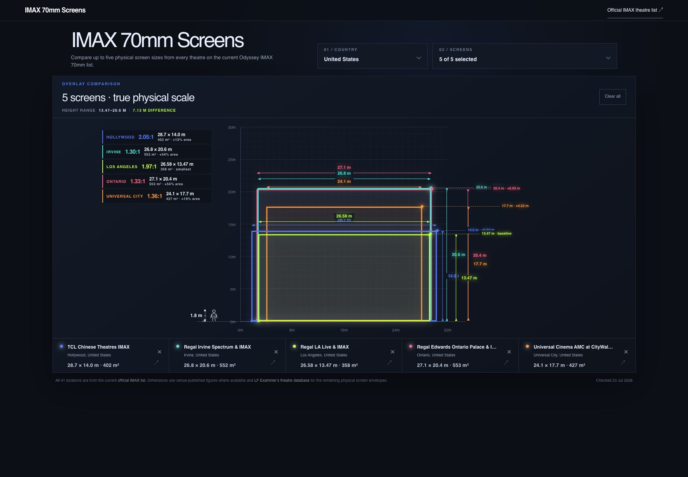

# IMAX 70mm Screens

An interactive, true-scale comparison of physical IMAX screen dimensions for
theatres presenting *The Odyssey* in IMAX 70mm.



## What the app does

The app makes it possible to compare the physical size and shape of up to five
IMAX screens at once.

- Filter theatres by country and region.
- Select up to five screens for comparison.
- View every screen on the same metre-based grid and floor line.
- Compare width, height, aspect ratio, and total screen area.
- See height differences with top-edge guides and measurement arrows.
- Use the 1.8 m human figure as a real-world scale reference.
- Open the source used for each theatre's dimensions.

The default view compares five California screens: Hollywood, Irvine,
Los Angeles, Ontario, and Universal City.

## Data

The theatre set comes from the current official IMAX list for *The Odyssey*.
Dimensions use venue-published figures where available, with LF Examiner's
theatre database used for remaining physical screen envelopes.

Measurements are displayed in metres. The chart preserves physical proportions,
so screens with similar dimensions may have outlines that nearly overlap.

## Technology

- React 19
- Next.js 16
- vinext and Vite
- TypeScript
- Tailwind CSS 4 with project-level CSS
- Cloudflare Workers-compatible output

## Run locally

Node.js 22.13 or newer is required.

```bash
npm install
npm run dev
```

Open the local URL printed by the development server.

## Validate a build

```bash
npm run build
npm run lint
```

## Project structure

```text
app/
  layout.tsx       Metadata, fonts, and application shell
  page.tsx         Screen data and comparison interface
  globals.css      Layout, chart, controls, and responsive styles
public/
  app-screenshot.jpg
  og.png
```
